<div align="center">


# Tidemark

**A weight tracker that shows the trend, not the noise.**

Weigh-ins, the trend and your plan, on your phone and nowhere else.
No account, no server, and nothing leaves the phone unless you send it.

Made by YSB Ventures Ltd.


</div>

<br/>

> [!NOTE]
> **Reading this without a technical background?** Start at *The problem*, *What's
> in it* and *One morning, end to end*. Those three explain what Tidemark is and
> what it does for someone trying to lose weight. Everything after *How the
> pieces fit* is for whoever maintains the code.

### How to read the diagrams

Every picture in this file uses the same four colours, and they always mean the
same thing. The connectors animate, so you can see which way the information
actually travels.

| | Means |
| :--- | :--- |
| 🟪 **Plum, coral border** | Tidemark itself: our code, running on the phone |
| 🟩 **Pale mint** | Built and working in the app today |
| 🟨 **Sand, dashed border** | In development: not built, not sold as built |
| ⬜ **Stone** | A person, or something outside the app |

---

## The problem, in one picture

A bathroom scale gives one number a day, and that number swings by a kilo or
more with salt, water, sleep and a late meal. Someone doing everything right
sees it go *up* on a Tuesday and decides it isn't working. That is the day most
people stop.



Plenty of apps log weight. What Tidemark does differently is **read the
numbers properly**: a trend that one odd day can't drag far, an honest weekly
rate, and a plan to hold it against. The trend uses Holt's linear smoothing
(`mobile/src/core/trend.ts`), which follows the direction you're heading
rather than trailing a week behind it the way a plain moving average does.

> [!TIP]
> **The target line is a guide, not a verdict.** That sentence is the product.
> When a weigh-in jumps, the Trend tab explains why that's normal, and nothing
> in the app scolds.

---

## What's in it

One app, free to download. The whole core is free; **Tidemark Plus** adds the
extras for people who want them.



> [!IMPORTANT]
> **Everything in green is built, tested and working. It is not on the App Store
> yet.** The iPhone app runs in Expo Go, and there's a web build the owner uses for
> testing, but there has been no signed iPhone build: the Apple Developer
> enrolment for YSB Ventures Ltd is in review. Until there is, three things are
> written and unit-tested but **not yet proven on a device**: buying and restoring
> Plus, iOS file encryption while the phone is locked, and the production
> hardening plugin.
>
> **Apple Health, iCloud sync and widgets are not built.** They stay tagged "in
> development" here until they are real. Do not describe them anywhere,
> including the App Store listing, as features.

---

## One morning, end to end

The clearest way to explain the app is to follow one ordinary morning.


Two details that matter more than they look:

- **Logging opens on your last weight**, with − and + steppers. Most weigh-ins
  are a tap or two and Save, which is the difference between a habit and a chore.
- **Reminders never contain a number.** A lock-screen notification is visible
  to anyone near the phone. The dose reminder doesn't even name the medication.

---

## How the pieces actually fit

This is the technical picture. **Everything that matters runs on the phone.**
The only things on the internet are static files and Apple's own store.



### Why there is no server, and no account

It was a decision, not a shortcut. Weight, medication and body photos are
**health data**, a special category under UK GDPR. Holding it on a server would
mean a lawful basis, a data processing setup, breach duties, security we'd have
to run around the clock, and a privacy label that no longer reads *Data Not
Collected*. Keeping it on the phone avoids all of that.

What it costs, said plainly:

- **No sync between devices.** A new phone gets your data from an iPhone backup,
  or from a Tidemark backup file you restore. iCloud sync is in development.
- **Lose the phone without a backup and the data is gone.** The app reminds you
  to back up, and Settings shows when you last did.
- **No remote switch.** Risky features can only be turned off in a build (see
  *Before a release*), because there's nothing to turn them off from.

> [!IMPORTANT]
> **Do not add an SDK that sends anything off the phone.** That includes
> analytics, crash reporting, attribution and "free" purchase SDKs. One of them
> breaks the *Data Not Collected* label, the privacy policy and the promise on
> the paywall in one go. If you need crash reports, use the ones Apple already
> collects from people who opted in (App Store Connect → Crashes).

### Where your data goes

Only where you send it.



| It leaves when… | What goes | Where |
| :--- | :--- | :--- |
| You export a backup or CSV | Everything, or the weights table | A file you choose where to put. Backups can be locked with a password |
| You tap *Email the error to support* | The error text and app version, never a weight | Your mail app, so you see it before you press send |
| Your iPhone backs itself up | The app's files, like every app's | iCloud or your computer, under your Apple account |
| You buy Plus | Nothing of yours | Apple handles the payment and tells the app you have Plus |

---

## The stack, in four layers

Left to right: what gets written, what it becomes, where that runs, and the one
outside service it talks to.



| Layer | What and why |
| :--- | :--- |
| **TypeScript 6** | Every file. Health numbers are not a place for `undefined` |
| **Expo SDK 57** · React Native 0.86 · React 19 | One codebase for the iPhone app and a web test build, developed without a Mac |
| **`src/core`** | Plain TypeScript with no React: trend, plan, medication, backups, Plus. Close to fully unit-tested |
| **react-native-svg** | The charts are drawn by hand. No chart library, so nothing to fight in dark mode or with large text |
| **AsyncStorage** + files | On the phone, encrypted by iOS while it's locked (`NSFileProtectionComplete`) |
| **@noble** scrypt and XChaCha20-Poly1305 | Password-protected backups, with audited libraries and the system's own randomness |
| **StoreKit 2** via `expo-iap` | Plus is sold by Apple. No account, no server, no purchase SDK |
| **GitHub Actions → Pages** | Tests every push, publishes the privacy policy and the web test build from `main`, checks the site every 6 hours |

---

## This repository

```
mobile/          the app: Expo, React Native, TypeScript (start here)
index.html       the original single-file web tracker, served at /classic
privacy.html     the privacy policy, served at /privacy.html
brand/           the logo, its generator and the brand sheet
fonts/           Space Grotesk and Hanken Grotesk, under the SIL Open Font Licence
assets/diagrams/ the diagrams in this file, as source and as SVG
scripts/         builds those diagrams
```

To run the app on your own iPhone, free, with no developer account:

```bash
cd mobile
npm install
npx expo start      # scan the QR code with the iPhone Camera; it opens in Expo Go
```

Use `npx expo start --tunnel` if the phone can't reach your computer (work and
university Wi-Fi often block it). `mobile/README.md` has the longer version, the
security notes and every feature in detail.

```bash
cd mobile
npm test            # unit, UI and whole-app tests
npm run typecheck
npx expo lint
```

CI runs all three on every push (`.github/workflows/ci.yml`) and fails if test
coverage drops below the floor set in `mobile/package.json`.

### Deploying the website

`.github/workflows/pages.yml` runs on every push to `main` and publishes:

| Address | What it is |
| :--- | :--- |
| `/Tracker/` | The website: what Tidemark does, Free and Plus, support questions and the full privacy policy. Use it as the App Store **Support URL** |
| `/Tracker/privacy.html` | The privacy policy on its own, which every app build links to. This is the page that has to stay up |
| `/Tracker/app/` | The web build of the app: the owner's private test tool, not a product. `noindex`, and not linked from anywhere |
| `/Tracker/classic/` | The original tracker, kept for the owner's old data. `noindex` |

The web build is not offered to anyone, so the privacy policy doesn't cover it.
It keeps its data in the browser's storage for `yameenbux.github.io`, which any
other site published from that GitHub account can read, so use it with test
data, not real medication records. Photos are switched off on web, because they
would fill the browser's storage.

**Settings → Pages → Source** must be **GitHub Actions**, not a branch.
The website is `site/index.html`. The privacy section is filled in from
`privacy.html` when the site is built, so edit the policy in one place only.

`site-check.yml` loads the main pages every 6 hours and fails, which makes GitHub
email you, if one is down. Only the deploy job can publish: the build job, which
installs packages, gets read access only, and every action is pinned to a commit.

> [!CAUTION]
> **`WEB_BASE_URL` decides every address in the web build.** The workflow sets it
> to `/Tracker` because Pages serves the repo from a subfolder. If the site ever
> moves to its own domain, set it to empty in the same change, or every script
> and icon on the live site 404s.

### Where things live

| What you want to change | File |
| :--- | :--- |
| How the trend is worked out | `mobile/src/core/trend.ts` |
| The plan, paces and breaks | `mobile/src/core/plan.ts` |
| Medication: due, taken, missed | `mobile/src/core/medication.ts` |
| What Plus unlocks, the product IDs | `mobile/src/core/plus.ts` |
| Talking to the App Store | `mobile/src/purchases.ts` |
| The paywall | `mobile/src/components/Paywall.tsx` |
| The tabs (Today, Trend, Habits, Body) | `mobile/src/screens/Tabs.tsx` |
| Setup, one question per screen | `mobile/src/screens/Onboarding.tsx` |
| Settings | `mobile/src/screens/SettingsScreen.tsx` |
| What's saved, and how it's checked on load | `mobile/src/core/storage.ts` |
| Backup files, plain and protected | `mobile/src/core/backup.ts`, `mobile/src/core/vault.ts` |
| Reminders | `mobile/src/reminders.ts` |
| Switching risky features off for a build | `mobile/src/features.ts` |
| Support email, privacy and terms links | `mobile/src/support.ts` |
| Colours and type, light and dark | `mobile/src/theme.ts` |
| The logo | `brand/make_logo.py`, then `mobile/src/components/Logo.tsx` |
| What the App Store review needs | `mobile/COMPLIANCE.md` |

---

## Free and Plus

| | |
| :--- | :--- |
| **Tidemark** | Free |
| **Plus, monthly** | £1.99 a month, 7 days free |
| **Plus, yearly** | £11.99 a year, 7 days free |
| **Plus, lifetime** | £19.99 once |

**The prices live in App Store Connect, not in the code.** The paywall shows
whatever Apple returns, in the person's own currency. The "Save 49%" badge and
the "£1.00 a month" line are worked out from those prices at runtime, and the
percentage is rounded down so it can never overstate the saving. Change a price
in App Store Connect and the paywall follows. Then update the table above,
`privacy.html` and `mobile/README.md` by hand, because they quote it.

Rules that hold whatever the price:

- **Nothing entered in a Plus feature is lost when Plus lapses.** It's hidden,
  kept, and comes back if Plus does.
- **The paywall keeps the terms Apple requires**: price and period, the trial,
  auto-renewal and how to cancel, Terms and Privacy links, and Restore.
- **No dark patterns.** No countdown timers, no fake "only today" prices, no
  pre-ticked anything.

---

## When something goes wrong

Most problems are a data problem, and the person fixes those themselves: every
restore takes a snapshot first, and data that can't be read is copied aside
rather than overwritten. The rest comes to us, and a fix reaches everyone, not
only the person who reported it.


### Who fixes what

| It is… | Who | How |
| :--- | :--- | :--- |
| A wrong weigh-in, a habit, the plan or goal | **You**, in the app | Tap it and change it. Deleting shows an Undo |
| Data lost after a restore | **You**, in Settings | The snapshot taken before the restore is kept for 30 days |
| A crash, or a number that's wrong | **Us** | The error screen's *Email the error to support* |
| Anything about a purchase or a refund | **Apple** | Purchases go through Apple; we can't see or refund them |

The support address is `yameen@ysbdesigns.uk`. It is in `mobile/src/support.ts`
and the privacy policy, and nowhere else needs changing if it moves.

---

## Before a release

> [!WARNING]
> **The website doesn't show the registered office address yet.** The Companies
> Act requires a company's website to show its name, number and registered
> office. The name and number are on the site and in the privacy policy. The
> registered office is the owner's home, so it stays off this public repo until
> the company moves to a registered office service; then add that address to
> the site footer and the policy.

In App Store Connect, once the developer account is approved:

1. **Business → Agreements**: sign the Paid Apps agreement and add bank and tax
   details. Without it, purchases fail even in testing.
2. **Apply for the Small Business Program** (15% commission instead of 30%).
3. **Create the app** with bundle ID `com.yameenbux.tidemark`.
4. **Create the products**: a subscription group with
   `com.yameenbux.tidemark.plus.monthly` and `.yearly`, each with a one-week free
   trial, and the non-consumable `com.yameenbux.tidemark.plus.lifetime`.
5. **Build and test**: `npx eas-cli build -p ios --profile production`, then
   `npx eas-cli submit -p ios --latest`, then buy, restore and cancel in
   TestFlight with a sandbox tester.

Risky features can be switched off for a build without touching the code: set
`EXPO_PUBLIC_DISABLE_MEDICATION=1` or `EXPO_PUBLIC_DISABLE_PROTECTED_BACKUPS=1`
under the build profile's `env` in `mobile/eas.json`.

---

## Before you change any copy

> [!CAUTION]
> **Tidemark is a record, not medical advice.** The medication log never suggests
> a dose, a change of dose or a missed-dose action. It records what you took.
> Copy that crosses that line could make the app a medical device in the UK's
> eyes, and that is a different product with a different approval process.

Three more that catch people out:

- **Never claim a feature that isn't built.** Apple Health, iCloud sync and
  widgets are *in development* in this file, in the app and on the App Store,
  until they are real.
- **Never round a saving up.** £11.99 against twelve months at £1.99 is 49.8%,
  so the badge says 49%. A rounded-up discount is a misleading price under UK
  consumer law.
- **"Data Not Collected" is a commitment, not a description.** It stays true
  only while nothing in the app sends data anywhere. Check it whenever a
  dependency is added.

British English throughout: *colour*, *programme*, *licence* (the noun), and
kilograms first, with stones and pounds for anyone who chooses them.

---

## The diagrams

Seven SVGs, and the connectors animate. GitHub renders mermaid but can't animate
it, so these are built rather than inlined. The sources stay in the repo as text,
so a diagram is still something you can edit and diff:

```bash
assets/diagrams/*.mmd             # the source, one file per diagram
node scripts/build-diagrams.mjs   # regenerates the SVGs
```

The build script holds the palette and the animation in one place. It declares
the colours light-first and redefines them under `prefers-color-scheme`, so the
diagrams follow GitHub's theme. It also keeps a `prefers-reduced-motion` guard,
so anybody who has asked their machine for less movement gets a still picture,
the same rule the app follows.

> [!NOTE]
> **Do not add a `font-family` override to that stylesheet.** Mermaid sizes every
> box for the font it measured with *before* the stylesheet is added, so changing
> the face afterwards clips the last line of a label.

Rendering needs a Chromium. If the machine has one already:

```bash
PUPPETEER_EXECUTABLE_PATH=/path/to/chrome node scripts/build-diagrams.mjs
```

---

## Licence

All rights reserved, YSB Ventures Ltd. Not open source. The fonts in `fonts/`
are under the SIL Open Font Licence, and the app lists every library it uses,
with its licence, under Settings → About.
